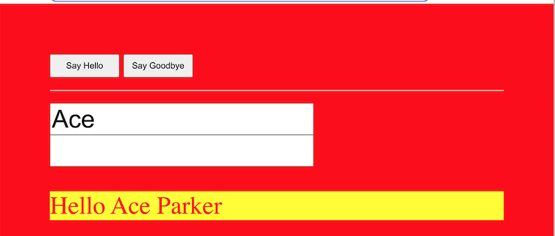
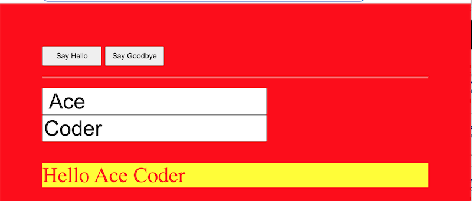

# Greeter-2 

1) Finish up the greeter app from last time:

```js
// 1 - get a reference to the button
// 2 - add a click event to button that calls a `sayHello` function
// 3 - create a `sayHello()` function
// 3A - get name of person from the <input>
// 3B - get a reference to the #output <p>
// 3C - update HTML of #output <p>
```

- Things to note (and try):
  - we can use `button.onclick` OR `button.addEventListener()`
    - these will both point to either a named or anonymous function (which is essentially a "self-contained block of code") that will be executed when the event occurs
    - what happens if we mistakenly put the parentheses after the function reference like this?
      - `button.onclick = sayHello();`
  - `<input>` elements have a `.value` property
  - we can use either string concatenation OR [template strings](https://developer.mozilla.org/en-US/docs/Web/JavaScript/Reference/Template_literals) to create the new string

<hr>

2) More to do:
- Move the `<script>...</script>` tag back up to the `<head>` section and use `window.onload` or `window.addEventListener()` to detect when the page has loaded
- If the user does not enter any text into the `<input>`, then use a default of "Peter" for the first name
  - also use `String.trim()` to get rid of any leading or trailing spaces that the user might have typed in

<hr>

3) Some CSS
- *Declaratively* (using CSS) make the button 50 pixels tall by 150 pixels wide, with a font-size of 14 points
- *Imperatively* (using JavaScript) give the paragraph a `red` text color, and a `yellow` background color
- Add a media query that kicks in at `1024px` or wider:
  - it gives the `<body>` a background-color of `red`
  - it gives the `<body>` 100 pixels of padding
  - be sure to preview this in [Chrome's Device Mode](https://developer.chrome.com/docs/devtools/device-mode/)
- Let's also review how to *embed* a font from [Google Fonts](https://fonts.google.com)
  
<hr>

4) You do the following
- Add a "last name" `<input>` so that we can greet the person using both their first and last names
- Write code that uses a default of "Parker" for the last name if one is not typed in
- Add a new button named "Say Goodbye" that will display "Goodbye <first-name> <last-name>" (instead of "Hello <first-name> <last-name>") when it is clicked
  - You will probably accomplish this by creating a new function named `sayGoodbye()`
  - Give the buttons `id` values (in the HTML) of `"btn-hello"` and `"btn-goodbye"`
- Optional Challenge:
  - Can you get rid of `sayHello()` and `sayGoodbye()` and have each button call a *single function* named `greet()`, that takes a `greeting` parameter - ex. `function greet(greeting){...}`

<hr>

5) Save your work!
- name the file **lastName-firstInitial-greeter-2.html**
- You do not need to upload this to the myCourses Assignment Dropboxes at this time, but you should complete it and keep it on hand as we will build on it further in the weeks ahead.
- If you are not able to get some part of it working, please ask about it (ask your instructor or TA in class, ask on Slack, consult an AI for ideas and guidance, etc) so that you're not stuck.

<hr>

- **The done version should look somewhat like these screen shots**
  

  

  

