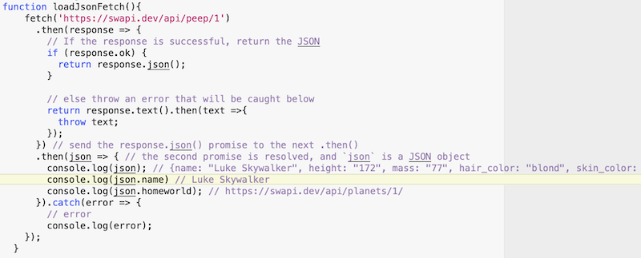

# HW - Ajax-5 - the `fetch()` API

## Overview

- The video walkthrough for this assignment is here. You will need to be logged into RIT/myCourses before you can access it: [HW - Ajax-5 (09:26)](https://rit.hosted.panopto.com/Panopto/Pages/Viewer.aspx?id=4c4ef9bb-e61f-4a82-8c39-ad9900d87348&start=0)
- We will build on what we did last time by modifying our `XHR`/JSON loading code to instead utilize the [`window.fetch()`](https://developer.mozilla.org/en-US/docs/Web/API/Fetch_API/Using_Fetch) API


<hr>

## I. About fetch()
- The `window.fetch()` method is similar to `XHR` in that it used to make Ajax requests, such as calling a remote API or fetching a local file from a server

### I-A. A Basic `fetch()` Request

- **⚠️ IMPORTANT:** The URL for the Star Wars API has changed. Please use this instead:  
  `http://people.rit.edu/~jxtadm/luke.json`
- The old URL was: `https://swapi.dev/api/people/1`.  
  Some code screenshots below may not have been updated before our class (April 2025).
- **Be sure to use the updated URL in your `fetch()` call.**
- The full API may not work as intended, but this example should still get you through the fetch demos!

```js
function loadJsonFetch(){
  const promise = fetch('http://people.rit.edu/~jxtadm/luke.json'); // get a Star Wars character
  console.log(promise); // "Promise {<pending>}"
}
```

- The `fetch()` method call above returns a [`Promise`](https://developer.mozilla.org/en-US/docs/Web/JavaScript/Guide/Using_promises) object. A Promise is a JavaScript object that "wraps" an asynchronous function.
- MDN decribes them fairly well: *"A Promise is an object representing the eventual completion or failure of an asynchronous operation. Since most people are consumers of already-created promises, this guide will explain consumption of returned promises before explaining how to create them. Essentially, a promise is a returned object to which you attach callbacks, instead of passing callbacks into a function."*
- The above code logs out the `Promise` object, which is "pending" and thus incomplete because the data has not yet downloaded. So this code isn't too useful yet, let's move on

<hr>

### I-B. Hooking into `Promise.then()` and `Promise.catch()`

- We can handle this promise that `fetch` returned to us by chaining `Promise.then()` and `Promise.catch()` methods to it
- `Promise.then()` will be called when the promise "resolves" (by internally calling `resolve()`)
- `Promise.catch()` will be called when the promise "rejects" (by internally calling `reject()`)
- Summary:
  - with `XHR` we hooked up callback methods to the `onload` event handler
  - with `fetch`, we add our callback method to the `.then()` of the return promise

<hr>


</hr>

- When you run this code, you should note that the (arrow) function passed to `.then()` runs, which means the request was successful 
- Note though, that `response.json()` also returns a *promise*, meaning that it is an asynchronous operation that is running on another thread, just like the `response` promise
- This means that we don't yet have access to the actual response data (the JSON) because this second promise has not yet *resolved* 
- So we now have TWO promises to worry about! What's the Solution? Another `.then()`

<hr>

### I-C. Resolving the `response.json()` promise

<hr>


</hr>

- When you run this code, both promises should resolve, and the code should log out the JSON object, as well as the `.name` and `.homeworld` properties
- Note that unlike `XHR`, with `fetch()` the JSON object is created for us automatically, thus we don't have to call `JSON.parse(e.target.responseText)`

<hr>

### I-D. The `response.ok` property

- The `response.ok` property returns `true` if the response has a status code between 200 and 299, and `false` in all other cases
- If `response.ok` is `true`, we will return `response.json()`, as we did before. If not, we will throw `response` to trigger our `Promise.catch()`
- Our final version of the code is below:

<hr>



</hr>

- Run the code and everything should work as belore
- Change the url to break it (in the URL I changed `people` to `peep`):
  - the server will return a 404 page, which means we'll throw an exception that will get caught at the bottom, and we'll be able to see the 404 page in the console
  - note that we are "throwing" `response.text()` rather than `response.json()` because much of the time the error content will be an HTML file
  
<hr>

## II. Start files & HW
- You might want to start by first making a copy of your **ajax-4/** folder from last time (if you don't have a copy of **ajax-4/**, check myCourses), and naming the copy **ajax-5/**
- Rename your completed HTML file from last time - from **xhr-get-json.html** to **fetch-get-json.html** 
- Go ahead and adapt your code from last time to use the `fetch()` API to download **pet-names.json** instead of `XHR`, and display the lists of pets as you did before. Be sure to use `.then()` and `response.ok` like we did in the last demo above
- See myCourses for submission instructions

<hr><hr>

| <-- Previous Unit | Home | Next Unit -->
| --- | --- | --- 
|   [**HW - Ajax IV**](HW-ajax-4.md)  |  [**IGME-330**](../README.md) | [**HW - Ajax VI**](HW-ajax-6.md) 
