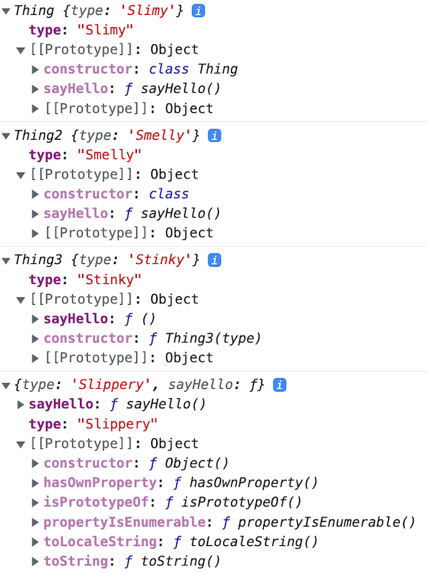

# ES6 Class Notes

<details>
  <summary>Table of Contents</summary>

- [ES6 Class Notes](#es6-class-notes)
  - [I. A Simple `class`](#i-a-simple-class)
    - [I-A. More ways to define a class](#i-a-more-ways-to-define-a-class)
    - [I-B. These 4 versions look and behave similarly](#i-b-these-4-versions-look-and-behave-similarly)
  - [II. Inheritance](#ii-inheritance)
  - [III. Building a `CircleSprite` class](#iii-building-a-circlesprite-class)
    - [III-A. Start code](#iii-a-start-code)
    - [III-B. Get started on `CircleSprite`](#iii-b-get-started-on-circlesprite)
    - [III-C. Create instances of `CircleSprite`](#iii-c-create-instances-of-circlesprite)
    - [III-D. Get a-move-on!](#iii-d-get-a-move-on)
    - [III-E. One more thing - `Object.assign()`](#iii-e-one-more-thing---objectassign)
  - [IV. More things you could add (but don't have to)](#iv-more-things-you-could-add-but-dont-have-to)

</details>


- [MDN - ES6 Classes](https://developer.mozilla.org/en-US/docs/Web/JavaScript/Reference/Classes) - *"Classes are a template for creating objects."*
- [IGME-235 - ES6 Class Reference Material](https://github.com/rit-igm-web/igme-235-shared/blob/main/tutorial/pixi-js-2.md)

<hr>

## I. A Simple `class`

```js
// Define the class
class Thing{
  constructor(type){
    this.type = type;
  }
  sayHello(){
    console.log(`I am a ${this.constructor.name} of type=${this.type}`);
  }
}

// Create an instance of that class
let thing = new Thing("Slimy");
console.log(thing); // Thing {type: 'Slimy'}
console.log(thing.sayHello()); // I am a Thing of type=Slimy
```

<hr>

### I-A. More ways to define a class

- Assign an anonymous class to a *variable*

```js
const Thing2 = class{
  constructor(type){
    this.type = type;
  }
  sayHello(){
    console.log(`I am a ${this.constructor.name} of type=${this.type}`);
  }
};

// gives us the same thing
let thing2 = new Thing2("Smelly");
console.log(thing2); // Thing2 {type: 'Smelly'}
console.log(thing2.sayHello()); // I am a Thing2 of type=Smelly
```

- [Function constructors](https://javascript.info/constructor-new) - the usual JS way to simulate classes before ES6

```js
function Thing3(type){
  this.type = type;
}

Thing3.prototype.sayHello = function(){
  console.log(`I am a ${this.constructor.name} of type=${this.type}`);
};

let thing3 = new Thing3("Stinky");
console.log(thing3); // Thing3 {type: 'Stinky'}
console.log(thing3.sayHello()); // I am a Thing3 of type=Stinky
```

- OR, just create an *object literal* instead of a class

```js
const thing4 = {
  "type" : "Slippery",
  sayHello(){
    console.log(`I am a ${this.constructor.name} of type=${this.type}`);
  }
};

console.log(thing4); // {type: 'Slippery', sayHello: ƒ}
console.log(thing4.sayHello()); // I am a Object of type=Slippery
```

### I-B. These 4 versions look and behave similarly

```js
console.log(thing);
console.log(thing2);
console.log(thing3);
console.log(thing4);
```



- For today we'll just use the regular `class` way (`Thing` above)

<hr>

## II. Inheritance

- Briefly, because we won't be using it this semester (but if you want to use inheritance on an assignment, have at it!)

```js
class Thing{
  constructor(type){
    this.type = type;
  }
  sayHello(){
    console.log(`I am a ${this.constructor.name} of type=${this.type}`);
  }
}

// NEW
class AlienThing extends Thing{
  constructor(type, alignment){
    super(type); // call superclass constructor in Thing
    this.alignment = alignment;
  }
  fireDeathRay(){
     console.log(`Feel the power of my ${this.alignment} ray!`);
  }
}

let alien = new AlienThing("Slinky","Evil");
console.log(alien); // AlienThing {type: 'Slinky', alignment: 'Evil'}
console.log(alien.sayHello()); // I am a AlienThing of type=Slinky
console.log(alien.fireDeathRay()); // Feel the power of my Evil ray!
```

<hr>

## III. Building a `CircleSprite` class

### III-A. Start code

**sprites-start.html**

```html
<!DOCTYPE html>
<html lang="en">
<head>
	<meta charset="utf-8" />
	<title>Sprites Start</title>
	<style>canvas{ border: 1px solid black; }</style>
	<script>
	
        "use strict";
        const canvasWidth = 640, canvasHeight = 480;
	
        let ctx;

	const loop = () => {
          setTimeout(loop, 1000/60);
          ctx.fillRect(0, 0, canvasWidth, canvasHeight);
	}
	
	const init = () => {
          ctx = canvas.getContext("2d");
          canvas.width = canvasWidth;
          canvas.height = canvasHeight;
          loop();
	};
	
	window.onload = init;

	</script>
</head>
<body>
<canvas id="canvas"></canvas>

</body>
</html>
```

<hr>

### III-B. Get started on `CircleSprite`

- add this to the top of the `<script>` tag in **sprites-start.html**

```js
class CircleSprite{
  static type = "arc"; // demoing a static (class) variable here
  constructor(x,y,radius,color){
    console.log(`${this.constructor.type} created`); // access static property (alternatively, CircleSprite.type)
    // YOU DO THIS - initialize .x, .y, .radius and .color properties
  
  }
  
  update(){
     // YOU DO THIS - increase the .x, and .y properties by 1
  }
  
  draw(ctx){
    // YOU DO THIS 
    // fill a circle - utilize the ctx argument, and the .x, .y, .radius and .color properties
    // don't forget about ctx.save() and ctx.restore()
  }
}
```

<hr>

### III-C. Create instances of `CircleSprite`

- Right after where `ctx` is declared, declare a variable named `sprites` that points at an empty array
- Inside of `init`, and *before* the call to `loop()`, create 2 instances of `CircleSprite` and add them to the array
  - `CircleSprite` #1 - x=100, y=100, radius = 20, color = green
  - `CircleSprite` #2 - x=100, y=200, radius = 30, color = red
  - Log out the `sprites` array to be sure that you were successful - check the console - it should appear similar to below:

```js
arc created
arc created
(2) [CircleSprite, CircleSprite]
  0: CircleSprite {x: 100, y: 100, radius: 20, color: 'green'}
  1: CircleSprite {x: 100, y: 200, radius: 30, color: 'red'}
```

<hr>

### III-D. Get a-move-on!

- Now write code in `loop()` that "loops through" the `sprites` array and calls the `update()` and `draw()` methods of the `CircleSprite` instances
- Don't forget to pass `ctx` into `draw()`
- When everything is working right, you should see your two circles (green and red) moving diagonally down the screen from the upper-left corner to the bottom-right corner

<hr>


<hr>

### III-E. One more thing - `Object.assign()`

- Check it out here - [`Object.assign()`](https://developer.mozilla.org/en-US/docs/Web/JavaScript/Reference/Global_Objects/Object/assign)
- Can you use it in your constructor to replace 4 lines of code, with one line of code?

<hr>

## IV. More things you could add (but don't have to)

- `xSpeed` and `ySpeed` variables (or better yet use vectors like you did in IGME-202 and have a normalized `fwd` property etc)
- "Bouncing" (or wrapping) when the circle encounters the edge of the canvas
- Add params to the constructor for `strokeWidth`, `strokeStyle`, `startAngle`, `endAngle` etc
- Modify the constructor to use object destructuring and default parameter values, and pass in single object of multiple properties to the constructor when calling it
- Create a `Sprite` super class and extend it
- And so on ...
